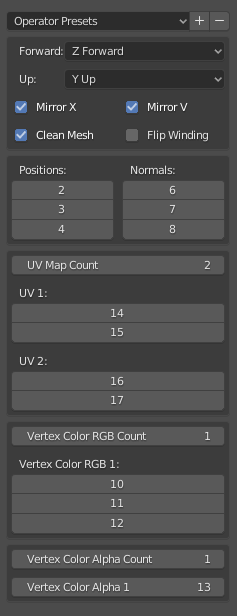

# CSV Importer

While created for Renderdoc .csv files, this is intended to be a general-purpose .csv mesh importer. It will assume vertex indicies as the row number, and crate faces based on that. All options on the import panel have descriptive tooltips.

# Supported Mesh Data

* Position
* Normal
* UV Maps (up to 5)
* Vertex Colors (up to 5)

# Import Options Screenshot

